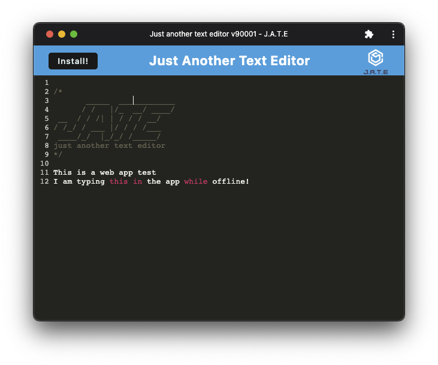

# PWA Demo: Text Editor

[](https://opensource.org/licenses/MIT)



## Description

A simple PWA (Progressive Web Application) demo that utilizes service workers and the idb indexed database wrapper. JATE (just another text editor) doesn't do anything particularly special, but  it does neatly showcase the offline functionallity brought by  service workers!

## Table of Contents

- [Installation](#installation)
- [Usage](#usage)
- [Tests](#tests)
- [Contributing](#contributing)
- [Questions](#questions)
- [License](#license)

## Installation

Run ```npm i``` and then ```npm run install``` in the home directory of the repo.

Run ```npm run start``` in the home directory of the repo.

## Tests

No tests implemented at this time.

## Contributing

Not accepting contributions at this time, but feel free to fork and modify freely.

## Questions

[Github: Gordon-Magill](https://github.com/Gordon-Magill)<br>
Email: gordon.magill@gmail.com
Please reach out via provided email for any questions.

## License

Licensed under [MIT](https://opensource.org/licenses/MIT).
